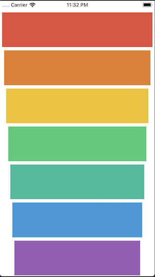

#  Xylophone

## Outline

This app makes me learn about how to play sound and use an Apple library called AVFoundation. I learn to solve problems by exploring StackOverflow, Apple Documentation and learning how to search for solutions effectively. By learning to use these tools, I’ll be able to start adding custom features to an app and get it to do what I want it to.

## What is Xylophone

Xylophone is an app to play sound notes, this app is transforming a real xylophone musical instrument into a simple app and make it colourful on each note.

## What I've learnt

* How to play sound using AVFoundation and AVAudioPlayer.
* Understand Apple documentation and how to use StackOverflow.
* Functions and methods in Swift.
* Data types.
* Swift loops.
* Variable scope.
* The ViewController lifecycle.
* Error handling in Swift.
* Code refactoring.
* Basic debugging.

## Screenshot

